# Tugas 1: Eksplorasi Database dengan Query

**Nama:** Ari Maulida Aprilia
**NIM:** 60324068

---

## A. Statistik Buku

### 1. Total Buku Seluruhnya
Query ini berfungsi untuk menghitung total judul buku dan total keseluruhan stok buku di perpustakaan.

```sql
SELECT COUNT(*) AS total_judul_buku, SUM(stok) AS total_keseluruhan_fisik
FROM buku;
```
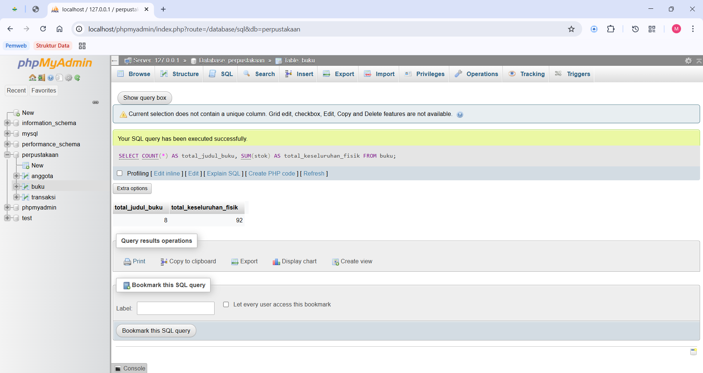

### 2. Total nilai inventaris (sum harga × stok)
Query ini berfungsi untuk menghitung total keseluruhan nilai aset atau inventaris perpustakaan (harga dikali stok).

```sql
SELECT SUM(harga * stok) AS total_nilai_inventaris 
FROM buku;
```
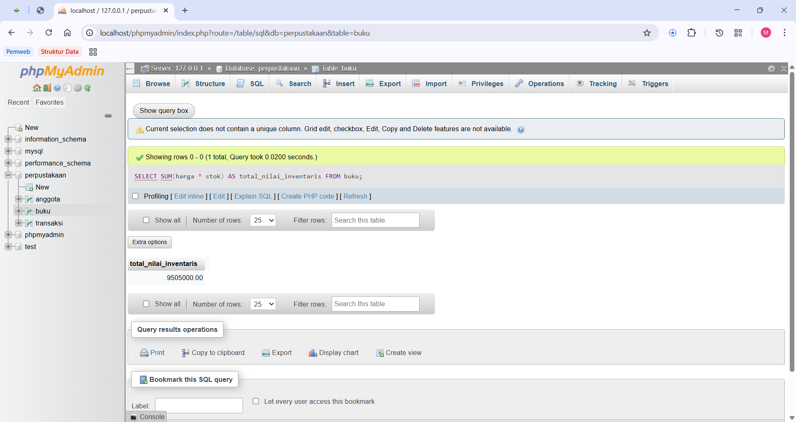

### 3. Rata-rata harga buku
Query ini berfungsi untuk menghitung rata-rata harga dari seluruh buku yang ada di perpustakaan.

```sql
SELECT AVG(harga) AS rata_rata_harga 
FROM buku;
```
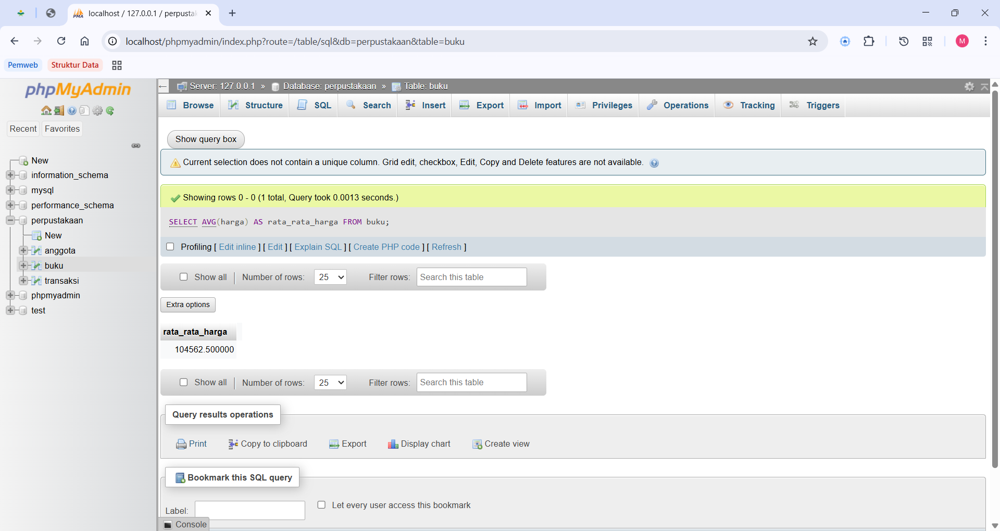

### 4. Buku termahal (tampilkan judul dan harga)
Query ini berfungsi untuk menampilkan judul dan harga dari satu buku yang harganya paling mahal.

```sql
SELECT judul, harga 
FROM buku 
ORDER BY harga DESC 
LIMIT 1;
```
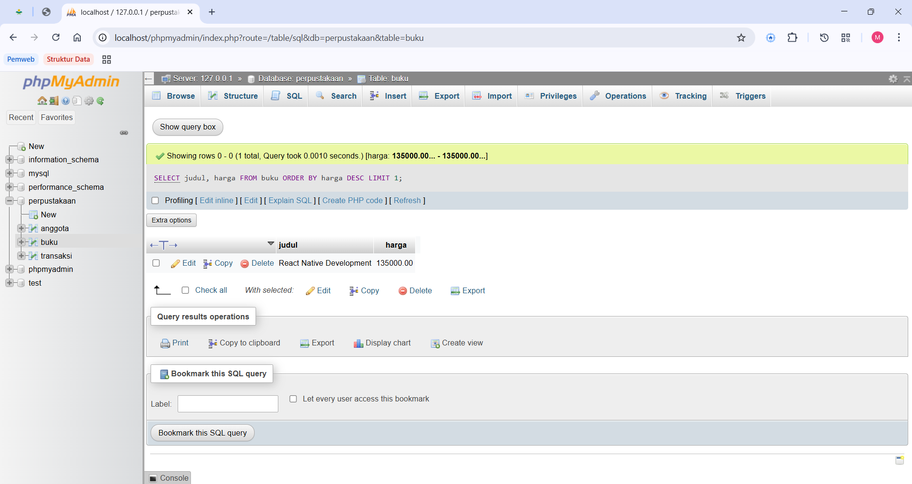

### 5. Buku dengan stok terbanyak
Query ini berfungsi untuk menampilkan judul dan jumlah stok dari satu buku yang memiliki fisik stok paling banyak.

```sql
SELECT judul, stok 
FROM buku 
ORDER BY stok DESC 
LIMIT 1;
```
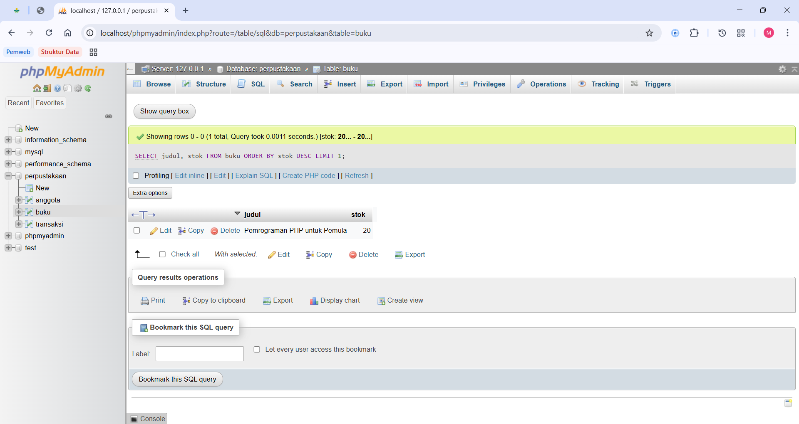


## B. Filter dan Pencarian

### 1. Semua buku kategori Programming yang harga < 100.000
Query ini memfilter buku yang masuk kategori Programming dengan batasan harga di bawah Rp 100.000.

```sql
SELECT * FROM buku 
WHERE kategori = 'Programming' AND harga < 100000;
```
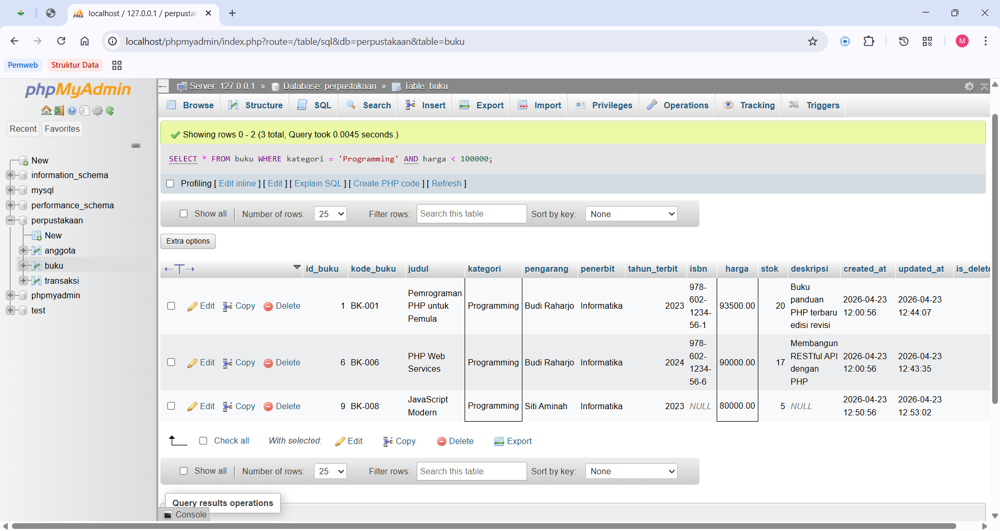

### 2. Buku yang judulnya mengandung kata "PHP" atau "MySQL"
Query ini berfungsi untuk mencari dan menampilkan buku yang pada judulnya terdapat kata "PHP" atau "MySQL".

```sql
SELECT * FROM buku 
WHERE judul LIKE '%PHP%' OR judul LIKE '%MySQL%';
```
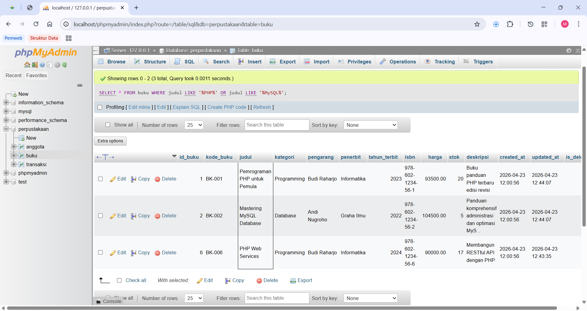

### 3. Buku yang terbit tahun 2024
Query ini berfungsi untuk menampilkan daftar buku yang diterbitkan secara spesifik pada tahun 2024.

```sql
SELECT * FROM buku 
WHERE tahun_terbit = 2024;
```
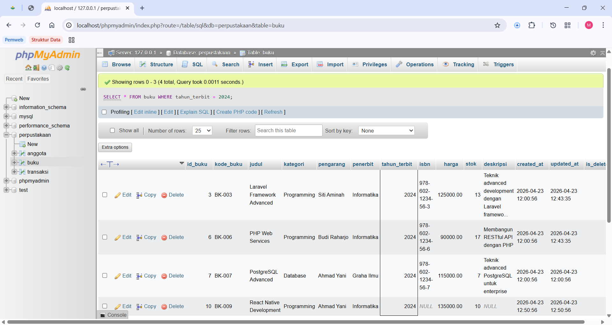

### 4. Buku yang stoknya antara 5-10
Query ini berfungsi untuk memfilter dan menampilkan buku-buku yang jumlah stoknya berada di antara rentang 5 hingga 10 buah.

```sql
SELECT * FROM buku 
WHERE stok BETWEEN 5 AND 10;
```
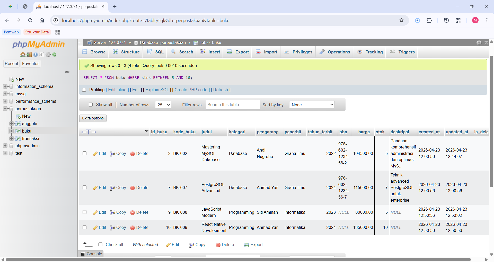

### 5. Buku yang pengarangnya "Budi Raharjo"
Query ini berfungsi untuk menampilkan semua buku yang ditulis secara spesifik oleh pengarang bernama "Budi Raharjo".

```sql
SELECT * FROM buku 
WHERE pengarang = 'Budi Raharjo';
```
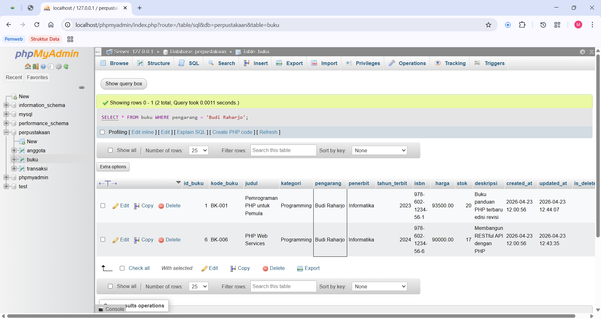


## C. Grouping dan Agregasi

### 1. Jumlah buku per kategori (dengan total stok per kategori)
Query ini berfungsi untuk menghitung total judul buku dan total fisik stok untuk masing-masing kategori secara terpisah.

```sql
SELECT kategori, COUNT(*) AS jumlah_judul, SUM(stok) AS total_stok 
FROM buku 
GROUP BY kategori;
```
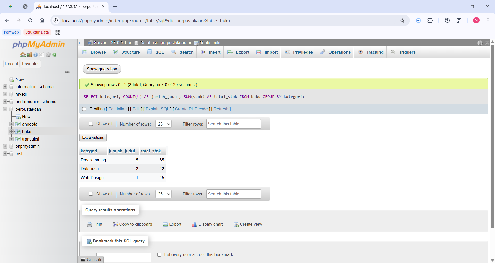

### 2. Rata-rata harga per kategori
Query ini berfungsi untuk menghitung dan menampilkan nilai rata-rata harga buku di setiap kategorinya.

```sql
SELECT kategori, AVG(harga) AS rata_rata_harga_kategori 
FROM buku 
GROUP BY kategori;
```
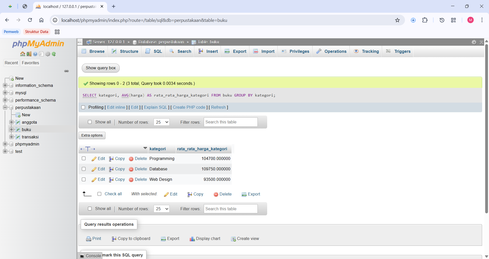

### 3. Kategori dengan total nilai inventaris terbesar
Query ini berfungsi untuk mencari satu kategori yang memiliki total nilai inventaris (total aset) yang paling besar.

```sql
SELECT kategori, SUM(harga * stok) AS total_inventaris 
FROM buku 
GROUP BY kategori 
ORDER BY total_inventaris DESC 
LIMIT 1;
```
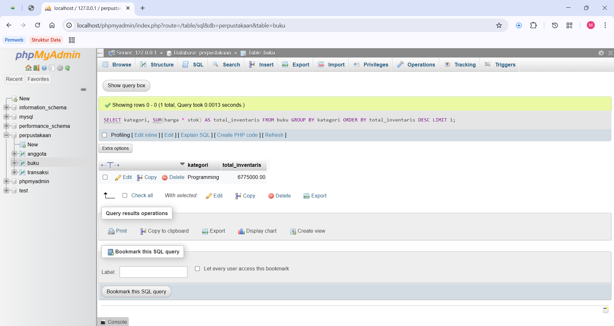


## D. Update Data

### 1. Naikkan harga semua buku kategori Programming sebesar 5%
Query ini berfungsi untuk memodifikasi data dengan menaikkan harga sebesar 5% khusus untuk buku-buku berkategori Programming.

```sql
UPDATE buku 
SET harga = harga + (harga * 0.05) 
WHERE kategori = 'Programming';
```
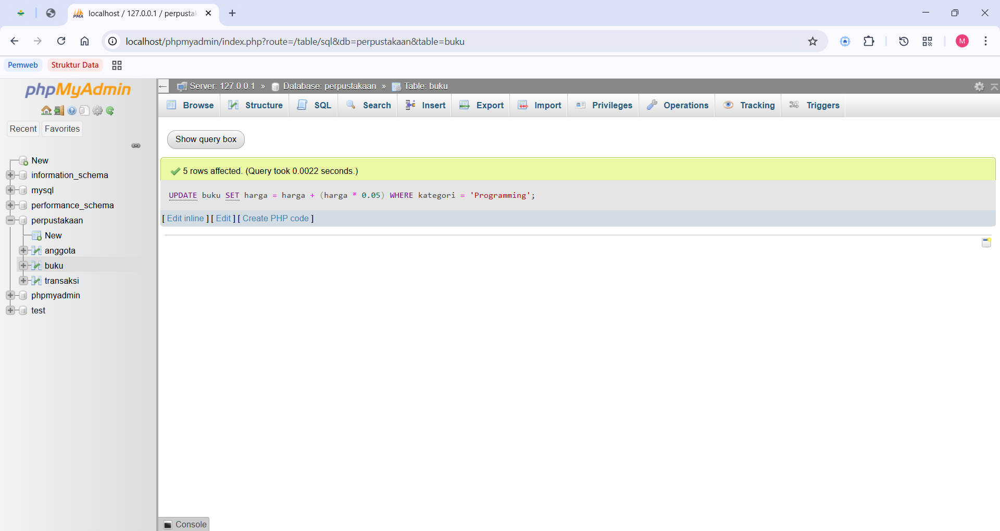

### 2. Tambah stok 10 untuk semua buku yang stoknya < 5
Query ini berfungsi untuk menambahkan 10 buah stok baru pada buku-buku yang stok saat ininya terpantau kurang dari 5.

```sql
UPDATE buku 
SET stok = stok + 10 
WHERE stok < 5;
```


## E. Laporan Khusus
### 1. Daftar buku yang perlu restocking (stok < 5)
Query ini berfungsi untuk menampilkan daftar buku yang perlu segera di-restock karena stok fisiknya kurang dari 5.
Di gambar tidak muncul hasilnya karna di pperintah sebelumnya sudah di update jika ada yang stok nya kurang dari 5, artinya sekarang sudah tidak ada lagi yang stoknya kurang dari 5.

```sql
SELECT judul, stok, kategori 
FROM buku 
WHERE stok < 5;
```
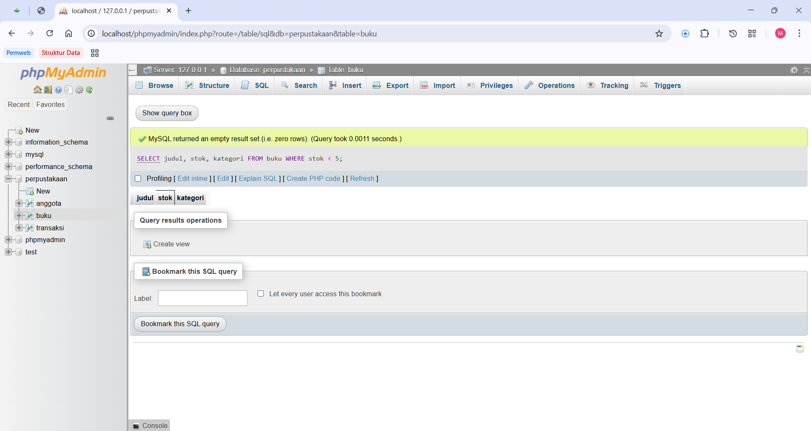

### 2. Tambah stok 10 untuk semua buku yang stoknya < 5
Query ini berfungsi untuk menampilkan peringkat 5 buku dengan harga jual yang paling mahal.

```sql
SELECT judul, harga, pengarang, kategori 
FROM buku 
ORDER BY harga DESC 
LIMIT 5;
```
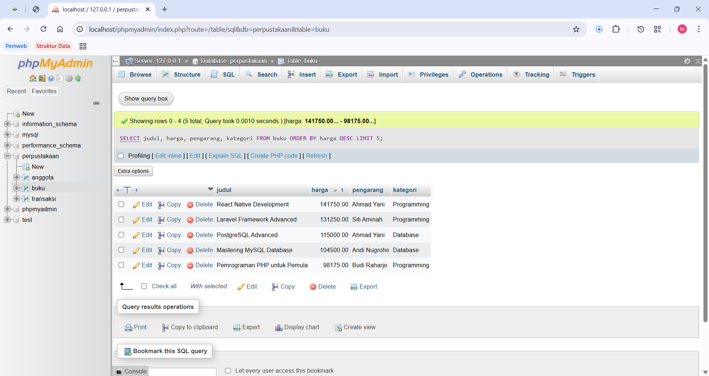


<br>
<br>
--------------------------------------------------------------------------------------------

# Tugas 2: Desain Database Lengkap

### 1. Struktur Tabel (Screenshot)
Berikut adalah screenshot struktur masing-masing tabel di dalam database:

a. Struktur Database
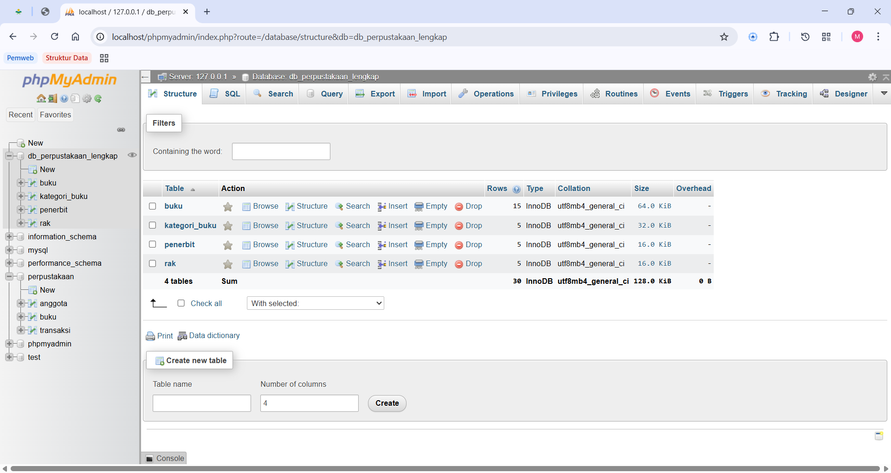

b. Struktur Tabel Buku:
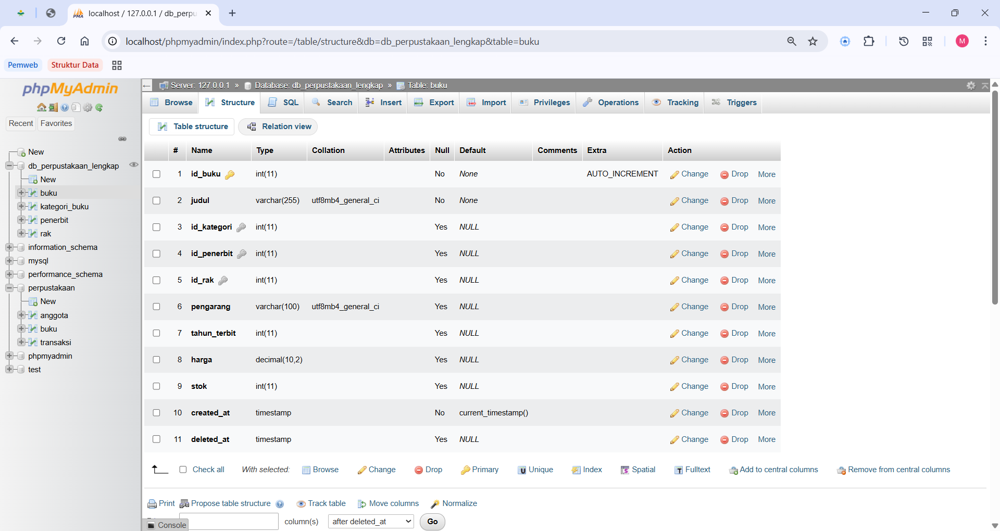

c. Struktur Tabel Kategori Buku:
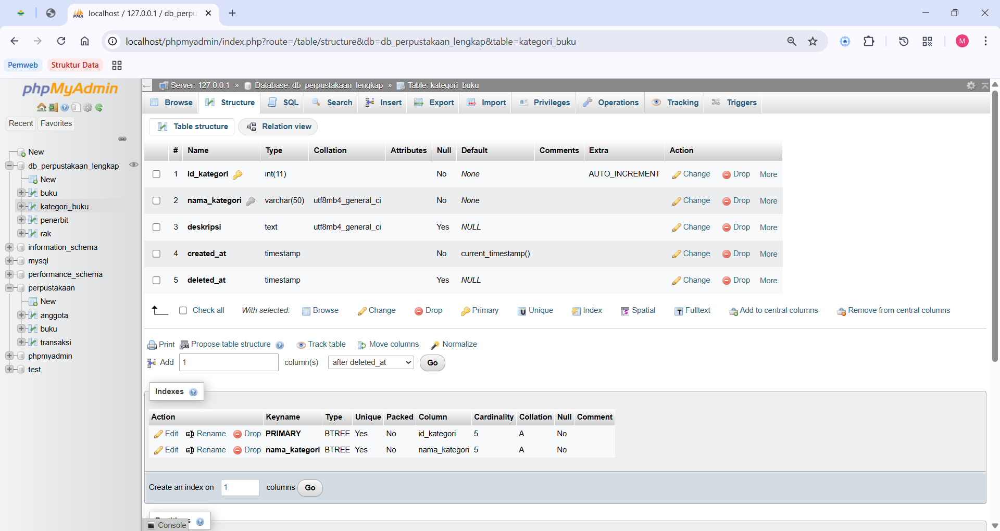

d. Struktur Tabel Penerbit 
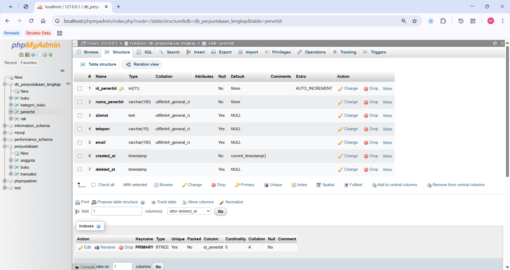

e. Struktur Tabel Rak
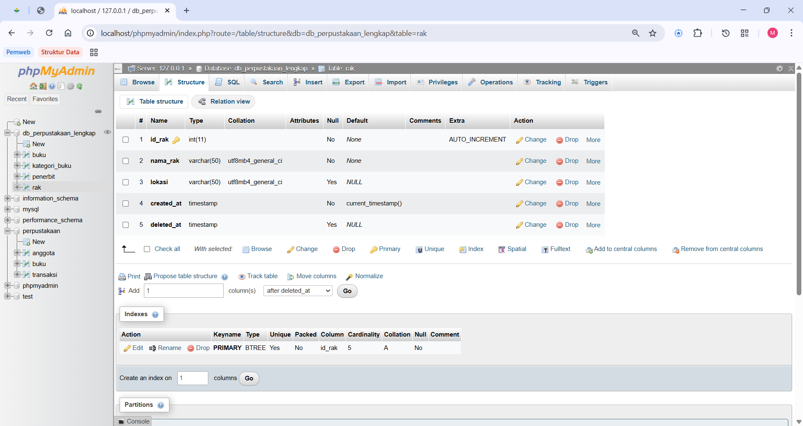

<br>

### 2. Data di setiap tabel
Berikut adalah screenshot data masing-masing tabel di dalam database:

a. Tabel Buku:
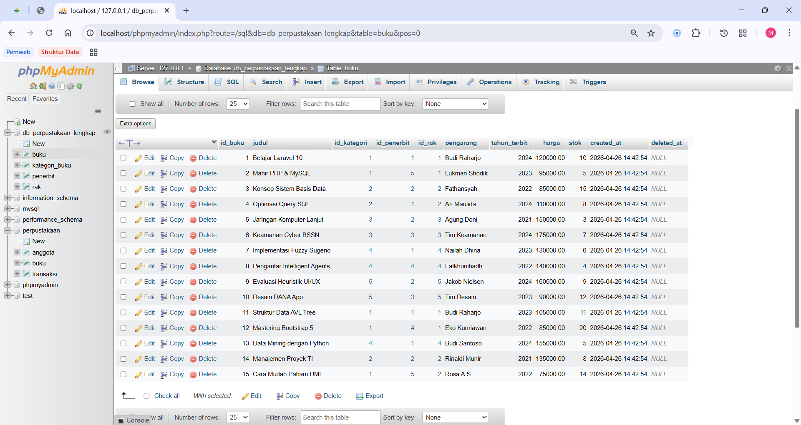

b. Tabel Kategori Buku:
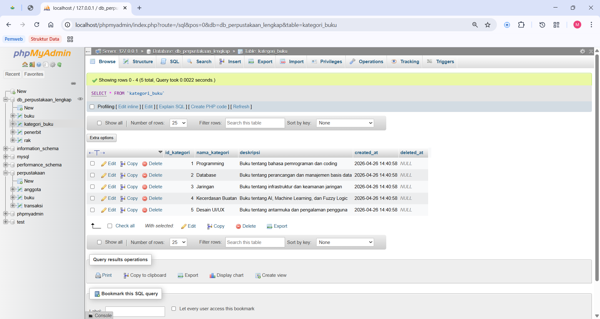

c. Tabel Penerbit:
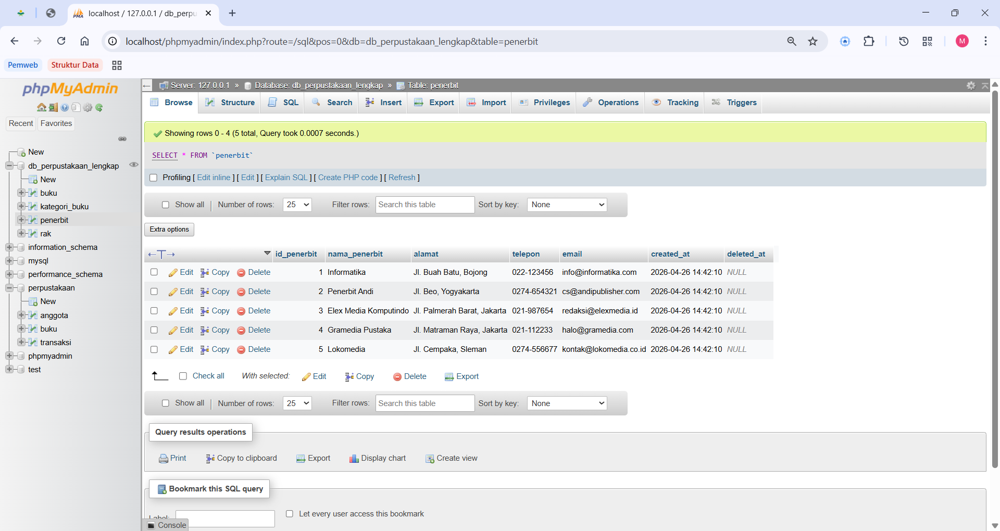

d. Tabel Rak:
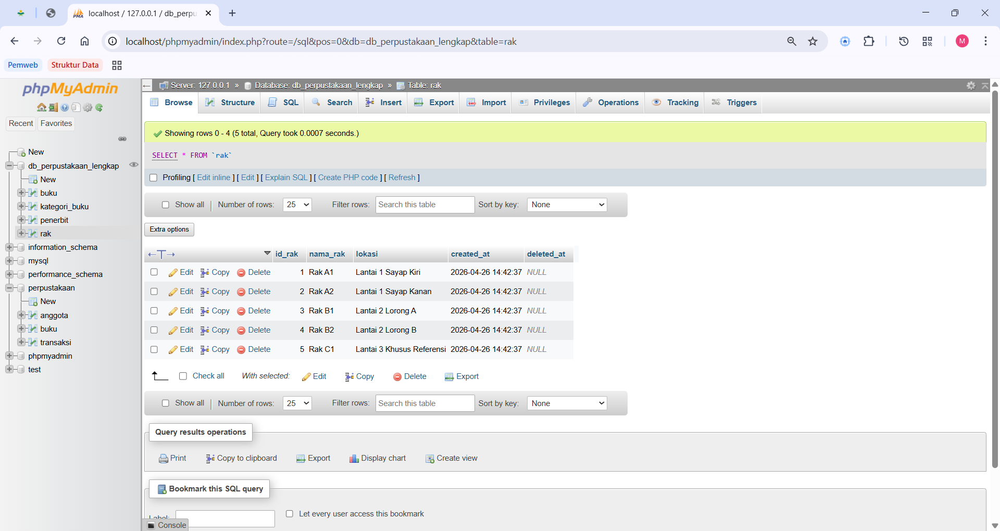


<br>

### 3. Hasil query JOIN
Berikut adalah screenshot Hasil query JOIN

A. JOIN untuk tampilkan buku dengan nama kategori dan penerbit
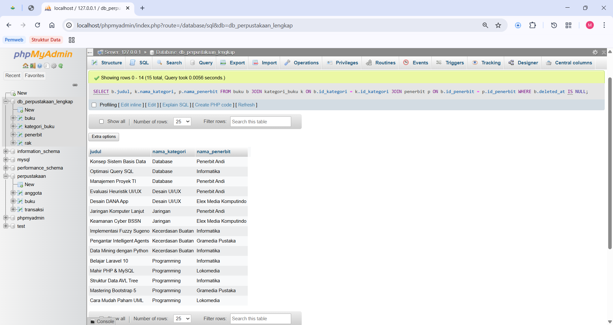

B. Jumlah buku per kategori
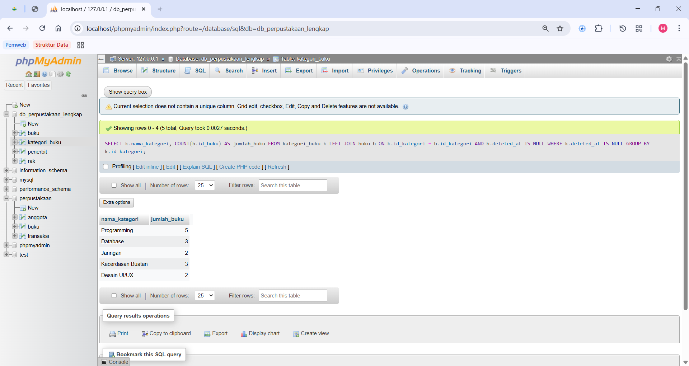

C. Jumlah buku per penerbit


D. Buku beserta detail lengkap (kategori + penerbit)
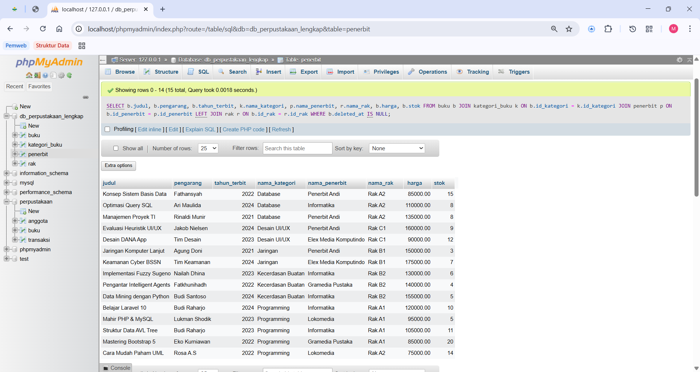


<br>

### 4. Gambar ERD
Berikut adalah gambar ERD antar tabel
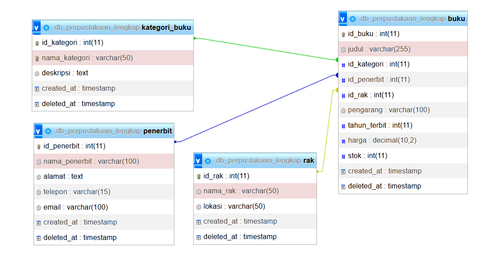